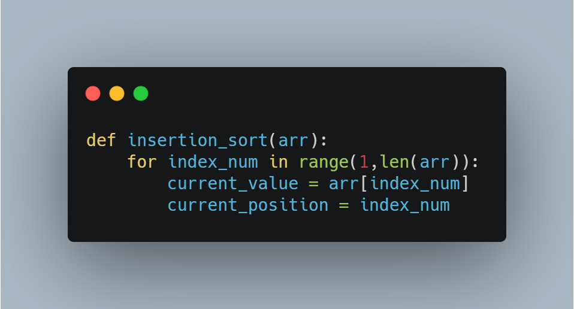
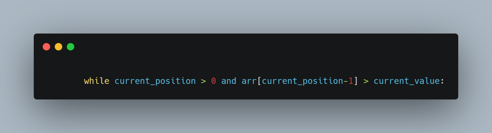
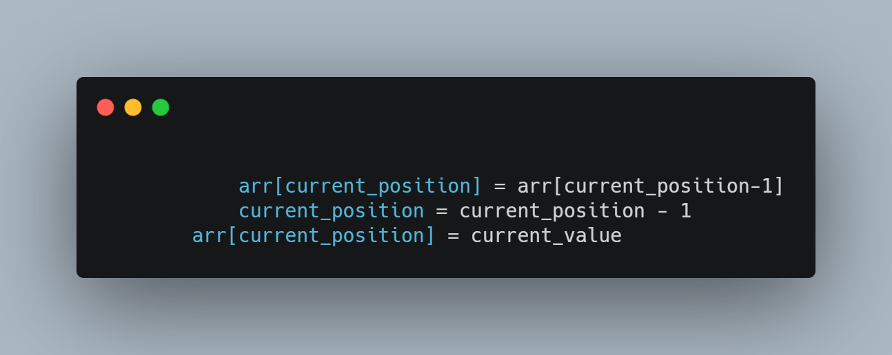

## how does insertion sort work?

an array is split into two arrays: sorted and unsorted like below.

`[1,2,3,5,6 | 4,14,12,1,7,]`

the first element in the unsorted array is checked so it can be moved to the correct place in the sorted array.

the insertion is done by moving all elements larger than the current element to the right.

`[1,2,3,5,6 | 4,14,12,1,7,]`

`[1,2,3,5,6,4> | 14,12,1,7,]`

`[1,2,3,5,4>,6 | 14,12,1,7,]`

`[1,2,3,4,5,6,14> | 12,1,7,]`

`[1,2,3,4,5,6,14,12> | 1,7,]`

`[1,2,3,4,5,6,12>,14 | 1,7,]`

 and so on...

first thing we do is create a for loop in the range of one and the length of the array.

next we establish our variables for the current value, which is the number we are comparing, and it's current position in the array.

next we create while loop to do the comparison until the number is in the correct position in the array.

lastly, we do the ole' swap-a-roo.

and that's it!

